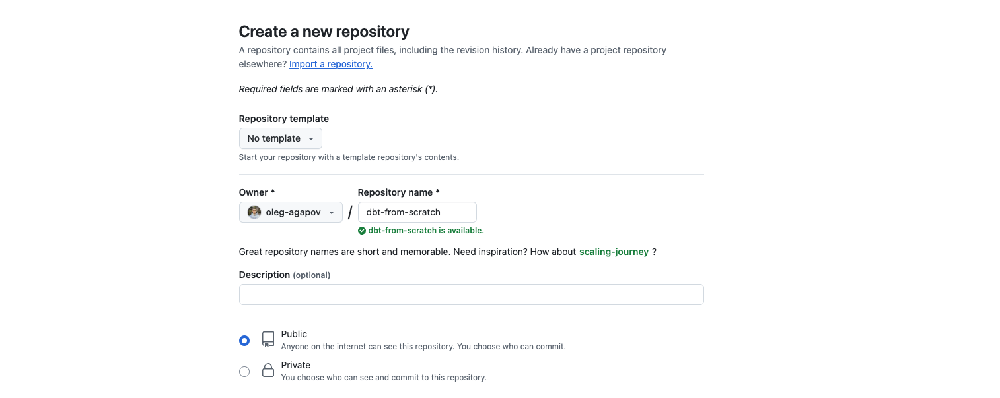
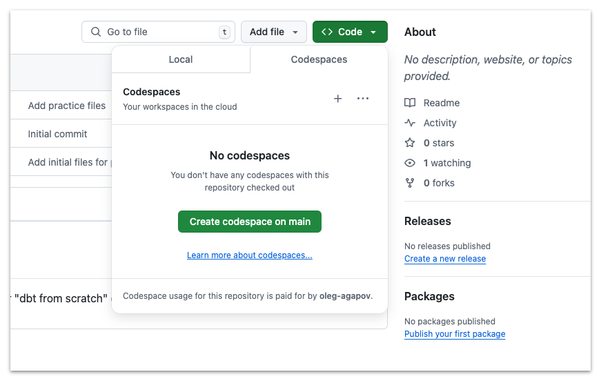
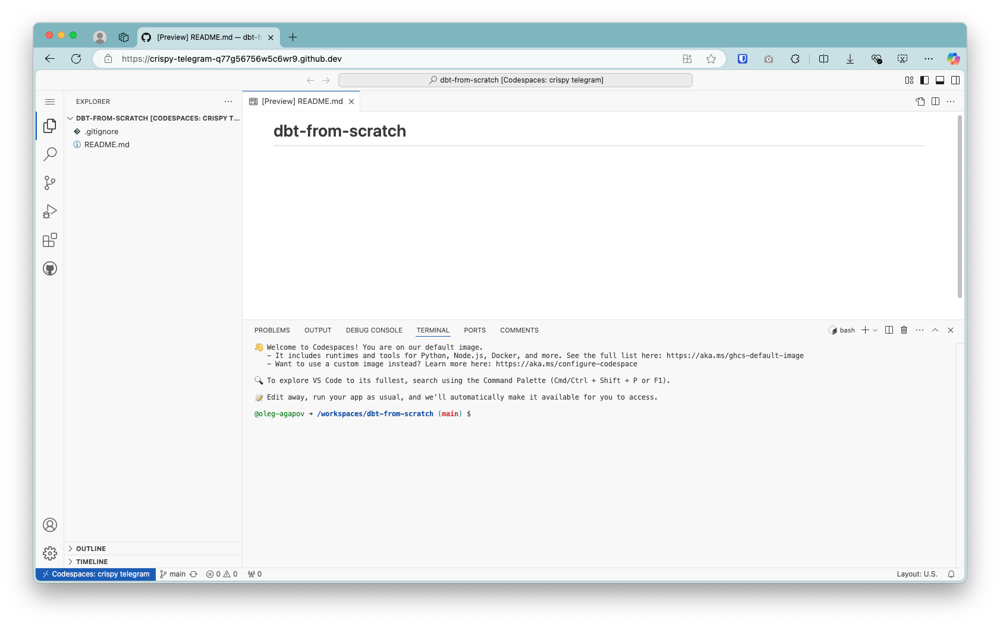
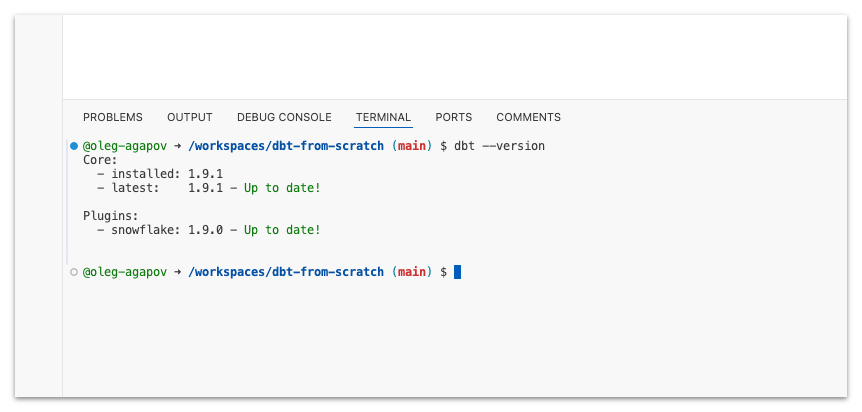

# Practice 1: Setting up the environment

In this task we will prepare our development environment, install dbt with the appropriate adapter and connect to a database.

🎯 Goal: have properly setup environment to successfully complete the course.

## Step 1: Prepare the environment

First you need to create a repository for your on GitHub. You can name it `dbt-from-scratch` or any other name you like. Make it Public, add a README and `.gitignore` file for Python.



You can clone the repository to your local machine using `git clone` command.

Alternatively, you can use GitHub Codespaces to create a new environment directly in the browser. Just click on the `Code` button and select `Create codespace on main`.



Next step is to prepare Python environment. If you work locally on your machine, you can create a virtual environment with:

```bash
python3 -m venv venv
```

And then activate the environment with:

```bash
source venv/bin/activate
```

> ⚠️ Note: don't forget to activate the virtual environment every time you start a new terminal session.

If you use GitHub Codespaces you can skip creating the virtual environment. Codespaces already have Python installed and you can install packages globally.



## Step 2: Install dbt

To install dbt you need to install two packages:
- dbt-core package
- adapter for your database

Create a new file called `requirements.txt` and add the following lines:

```txt
dbt-core==1.9.*
dbt-snowflake==1.9.*
```

Now install the packages with:

```bash
pip install -r requirements.txt
```

To check that dbt is installed correctly, run the following command:

```bash
dbt --version
```

This should return the version of dbt you have installed.



## Step 3: Bootstrap the project

Before we can start working with dbt, we need to connect to a database. In this course we will use Snowflake as a database.

To connect to Snowflake you need to login with your temporary account:

1. Go to https://sd96455.us-central1.gcp.snowflakecomputing.com/
2. Login with the following credentials:
   - Username: (ask the instructor for the username)
   - Password: `p@ssw0rd`
   
   It will ask to change the password upon first login (please remember new password).
3. If you successfully logged in, you can proceed to the next step.
4. During the setup you will need to setup DUO authentication. Just follow the instructions.

Now we can create a new dbt project. Run the following command:

```bash
dbt init
```

You gonna need to add the following information:
1. name of the project, enter `dbt_course` (only letters, digits, underscore are allowed)
2. the adapter you want to use, in our case `[1] snowflake`
3. specify the credentials to the database:

| Parameter             | Value                                                     |
| --------              | -------                                                   |
| account               | sd96455.us-central1.gcp                                   |
| user                  | <your_username>                                           |
| authentication type   | [1] password                                              |
| password              | <your_password> (it won't be visible in the terminal)     |
| role (dev role)       | student__b_role                                           |
| warehouse             | student_wh                                                |
| database              | dev                                                       |
| schema                | dbt_<your_username>                                       |
| threads               | 1                                                         |

Now you should have a new directory called `dbt_course` which contains starter dbt project.

> ⚠️ Also there will be created `logs` directory, which you can safely delete.

Now you need to navigate to the project directory:

```bash
cd dbt_course
```

And finally, check that everything is working by running the following command:

```bash
dbt debug
```

When running this command, it will send you push notification to Duo. You need confirm that this is you.

To avoid multiple push requests to your Duo app, you should add additional property for your profiles. First step is to open profiles file:

```bash
code  ~/.dbt/profiles.yml
```

Next, add `authenticator: username_password_mfa` to the configuration, like so:

```yaml
dbt_course:
  outputs:
    dev:
      account: sd96455.us-central1.gcp
      # add the following line
      authenticator: username_password_mfa
      #
      database: dev
      password: ...
      role: student__b_role
      schema: ...
      threads: 1
      type: snowflake
      user: ...
      warehouse: student_wh
  target: dev
```

From now on, you only need to confirm push notification only for the first command, all subsequents commands will not require push confirmation.

## Troubleshooting database connection


#### Error `Profile should not be None if loading profile completed`

You probably forgot to change the working directory to the project directory. Make sure you are in the `dbt_course` directory when running `dbt debug`.

```bash
cd dbt_course
```

#### I made a mistake during the initialization

You can check correctness of your database credentials by inpecting `profiles.yml` file:

```bash
# on your local machine
open ~/.dbt/profiles.yml

# in Codespaces
code ~/.dbt/profiles.yml
```

There should be `dbt_course` profile with all credentials.

## Step 4: Commit the changes

Commit the changes to the repository with the following commands:

```bash
git add .
git commit -m "Add dbt project files"
git push
```
