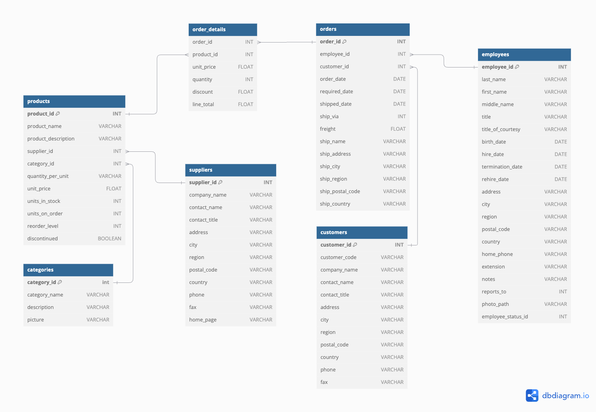

# Practice 2: Building your first dbt model

The task this time is to build your first dbt model, source and seed. We will also practice with dbt commands and node selection syntax.

🎯 Goal: learn basics of dbt by implementing some models and run then in terminal

## Step 0: Learn the source data

In this project, we will work with data from a fictional company called Dunder Mifflin. The company sells various paper products in the United States. The dataset includes information about orders, order details, products, suppliers, employees, and other business operations.

Below you can see a relationship diagram of the tables in the database:



Take some time to understand the data and relationships between the tables.

## Step 1: Create dbt sources and seeds

Let's start by creating dbt sources. Sources are existing tables in the database that we want to use in our dbt project.

> Note: In `/models` folder you may find SQL files created by the `dbt init` command. You can safely delete all of them.

Create a new file called `sources.yml` in the `models` directory. Next, define a source called 'dunder_mifflin' with the following tables:

```yaml
sources:
  - name: dunder_mifflin
    database: raw
    schema: dunder_mifflin
    tables:
      - name: categories
      - name: customers
      - name: employees
      - name: order_details
      - name: orders
      - name: products
      - name: shippers
      - name: suppliers
```

Now you will be able to reference these tables in your dbt models using the `{{ source('dunder_mifflin', '<table_name>') }}` syntax.

Next thing to do is to create seeds. Seeds are static data that you want to use in your dbt project. In this case, we will create a seed for the employee status.

Create a new file called `employee_status.csv` in the `seeds` directory. The file should contain the following data:

```csv
status_id,status_name
0,Active
-1,Suspended
-2,Terminated
-3,Retired
```

Each seed can have a YAML files that describes that seed and its data types. Create a new file called `employee_status.yml` in the `seeds` directory. The file should contain the following:

```yaml
seeds:
  - name: employee_status
    config:
      columns_types:
        status_id: int
        status_name: varchar
```

To load the seed data into the database, run the following command:

```bash
dbt seed
```

You can reference the seed data in your dbt models using the `{{ ref('seed_name') }}` syntax.

> You can actually check the table in Snowflake by running `SELECT * FROM <seed_name>` in the worksheet.

## Step 2: Create dbt models

With the sources and seeds in place, let's create our first dbt model.

In this task we will solve two practical problems.

First, we want to know total historical sales for each product, plus information about product category, suppliers and units in stock. That would give our business stakeholders info about products performance and inventory levels.

Second, find last 5 customers of each salesman that are no longer work in the company. This will help us reassign salesperson for such customers to keep them happy and maintain good relationships.

You got two SQL queries from data analysts.

Create two new files in the `models` directory: `product_info.sql` and `retired_salesmen.sql`. Copy the queries into the files.

<details>
  <summary>product_info.sql</summary>
  
  ```sql
  with 

  orders as (
      select
          product_id,
          count(order_id) as times_ordered,
          sum(line_total) as gross_sales
      from raw.dunder_mifflin.order_details
      group by all
  ),
  categories as (
      select
          category_id,
          category_name
      from raw.dunder_mifflin.categories
  ),
  suppliers as (
      select
          supplier_id,
          company_name
      from raw.dunder_mifflin.suppliers
  )
  select
      products.product_id,
      products.product_name,
      categories.category_name,
      suppliers.company_name as supplier_name,
      products.units_in_stock,
      products.units_on_order,
      products.discontinued,
      orders.times_ordered,
      orders.gross_sales
  from raw.dunder_mifflin.products as products
  left join orders on orders.product_id = products.product_id
  left join categories on categories.category_id = products.category_id
  left join suppliers on suppliers.supplier_id = products.supplier_id
  order by orders.gross_sales desc
  ```
</details>


<details>
  <summary>retired_salesmen.sql</summary>
  
  ```sql
  with
    employee_status as (
        select column1 as status_id, column2 as status_name
        from values 
            (0,'Active'),
            (-1,'Suspended'),
            (-2,'Terminated'),
            (-3,'Retired')
    ),

    last_customers as (
        select 
            employee_id, 
            customer_id,    
        from raw.dunder_mifflin.orders
        qualify dense_rank() over(partition by employee_id order by order_date desc, order_id) <= 5
    )

    select
        last_customers.employee_id,
        employees.first_name || ' ' || employees.last_name as employee_full_name,
        last_customers.customer_id,
        customers.company_name,
        employee_status.status_name
    from last_customers
    left join raw.dunder_mifflin.employees on employees.employee_id = last_customers.employee_id
    left join employee_status on employee_status.status_id = employees.employee_status_id
    left join raw.dunder_mifflin.customers on customers.customer_id = last_customers.customer_id
    where employee_status.status_name in ('Suspended', 'Terminated', 'Retired')
  ```
</details>

Models in dbt are simply SQL queries, so you can copy and paste the queries directly into the files.

In the next step we will materialize these models in the database.

## Step 3: Practice dbt commands

To materialize all your existing models run the following command in terminal:

```bash
dbt run
```

You should see somewhat similar output to this:

```bash
1 of 2 START sql view model dbt_oleg.retired_salesmen ......................... [RUN]
2 of 2 START sql view model dbt_oleg.product_info .............................. [RUN]
1 of 2 OK created sql view model dbt_oleg.retired_salesmen .................... [SUCCESS 1 in 0.58s]
2 of 2 OK created sql view model dbt_oleg.product_info ......................... [SUCCESS 1 in 1.22s]

Finished running 2 view models in 0 hours 0 minutes and 2.63 seconds (2.63s).

Completed successfully

Done. PASS=2 WARN=0 ERROR=0 SKIP=0 TOTAL=2
```

If for some reason you see errors, check that you are running this command from the `/dbt_course` (command `cd dbt_course` may help you here). Also, make sure that Python's virtual environment is activated.

Now you can check the results of your models in Snowflake by running `SELECT * FROM <model_name>` in the Snowflake UI.

## Step 4: Improving models

Our models are working, but we can make them better.

If you check SQLs carrefully, you may notice that we are using `raw.dunder_mifflin` schema in the queries. This is not a good practice, because we are hardcoding table names. 

Better approach is to use `source()` or `ref()` macros instead.

Open `product_info.sql` model once again and find all places where we are using `raw.dunder_mifflin` schema. Replace all of them with sources, e.g.:

- `raw.dunder_mifflin.order_details` -> `{{ source('dunder_mifflin', 'order_details') }}`
- `raw.dunder_mifflin.categories` -> `{{ source('dunder_mifflin', 'categories') }}`
- `raw.dunder_mifflin.suppliers` -> `{{ source('dunder_mifflin', 'suppliers') }}`
- `raw.dunder_mifflin.products` -> `{{ source('dunder_mifflin', 'products') }}`

> Note: right now you won't see any changes to how models are running, but in the next practices you will see the benefits of using sources and refs.

After you've made the changes, let's re-run `dbt run` command again to see if everything is still working:

```bash
dbt run -s product_info
```

The model should run successfully. If you see any errors, check the SQL code for typos.

Now let's do the same with the `retired_salesmen.sql` model.

There you will see several places where we are using `raw.dunder_mifflin` schema:

- `raw.dunder_mifflin.orders` -> `{{ source('dunder_mifflin', 'orders') }}`
- `raw.dunder_mifflin.employees` -> `{{ source('dunder_mifflin', 'employees') }}`
- `raw.dunder_mifflin.customers` -> `{{ source('dunder_mifflin', 'customers') }}`

Another improvement we could make is to replace the hardcoded values in the `employee_status` CTE with a reference to the seed data.

Replace the hardcoded values with `ref('employee_status')` like this:

```sql
employee_status as (
    select status_id, status_name
    from {{ ref('employee_status') }}
)
```

Now re-run the `dbt run` command to see if everything is still working:

```bash
dbt run -s retired_salesmen
```

Commit your changes to the repository.

```bash
git add .
git commit -m "Implemented models with sources and seeds"
git push
```
