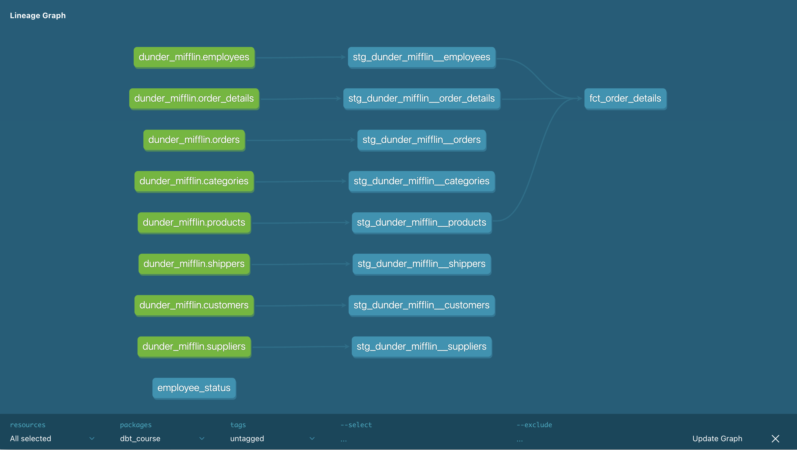

# Practice 4: Writing tests and docs

dbt has intgrated data quality framework and ability to document models.

🎯 Goal: learn how to write model tests and documentation for dbt models.

## Step 1: Create YAML schema for models

First step before implementing tests and documentation is to create a YAML schema for the models.

Let's create a schema file for `stg_dunder_mifflin__orders` model.

Go and create file called `stg_dunder_mifflin__orders.yml` in the same folder with the model itself, with the following content:

```yaml
models:
  - name: stg_dunder_mifflin__orders
    columns:
      - name: order_id
      - name: customer_id
      - name: employee_id
      - name: order_date
      - name: required_date
      - name: shipped_date
      - name: shipper_id
      - name: freight
      - name: ship_name
      - name: ship_address
      - name: ship_city
      - name: ship_region
      - name: ship_postal_code
      - name: ship_country
```

For now, let's skip other staging files and proceed with intermediates and marts.

Create the following schemas:

<details>
<summary><b>models/intermediates/sales/int_orders_aggregated_by_products.yaml</b></summary>

```yaml
models:
  - name: int_orders_aggregated_by_products
    columns:
      - name: product_id
      - name: times_ordered
      - name: gross_sales
```

</details>

<details>
<summary><b>models/marts/core/retired_salesmen.yml</b></summary>

```yaml
models:
  - name: retired_salesmen
    columns:
      - name: employee_id
      - name: employee_full_name
      - name: customer_id
      - name: company_name
      - name: status_name
```

</details>

<details>
<summary><b>models/marts/product/product_info.yml</b></summary>

```yaml
models:
  - name: product_info
    columns:
      - name: product_id
      - name: product_name
      - name: category_name
      - name: supplier_name
      - name: units_in_stock
      - name: units_on_order
      - name: discontinued
      - name: times_ordered
      - name: gross_sales
```

</details>


Remember, those files are only metadata explaining our models. Even if you describe only some columns and some models, your project will still work. However, it is a best practice to describe all models and columns in your project.

> Note: we will come back to writing more schema files in the following week using some advanced tools.


## Step 2: Create documentation

Having schema files in place it's actually easy to start writing documentation. For every model and column you can add `description` property and add all necessary documentation there. This description supports Markdown format, so you can implement quite advanced docs.

Let's take our staging model with orders. Here how we can describe this model:

```yaml
models:
  - name: stg_dunder_mifflin__orders
    description: |
      This model contains order data from Dunder Mifflin's sales system.

      If you need information about products sold, refer to `order_details` model.
    
    columns:
      - name: order_id
        description: "Unique identifier for each order."
      
      - name: customer_id
        description: "Unique identifier for each customer."
      
      - name: employee_id
        description: "Unique identifier for the employee who handled the order."
      
      - name: order_date
        description: "Date when the order was placed."
      
      - name: required_date
        description: "Date by which the order is required to be delivered."
      
      - name: shipped_date
        description: "Date when the order was shipped."
      
      - name: shipper_id
        description: "Unique identifier for the shipper handling the delivery."
      
      - name: freight
        description: "Cost of shipping the order."
      
      - name: ship_name
        description: "Name of the recipient or the shipping entity."
      
      - name: ship_address
        description: "Address where the order is to be delivered."
      
      - name: ship_city
        description: "City where the order is to be delivered."
      
      - name: ship_region
        description: "Region where the order is to be delivered."
      
      - name: ship_postal_code
        description: "Postal code of the delivery address."
      
      - name: ship_country
        description: "Country where the order is to be delivered."
```

Similarly, you can proceed and add description for other models yourself.

Let's now see static documentation that can be generated by dbt.

First you need to generate static HTML file and corresponding metadata with:

```bash
dbt docs generate
```

To preview tje filanl docs locally (i.e. from your laptop) run:

```bash
dbt docs serve
```

You should a main page of the generated docs:


If you click teal button in lower right, it will reveal our DAG:



Finally, if you search for documented staging model, you will find the descriptions that we put in schema file:


## Step 3: Write data tests

Let's continue developing our project by adding some tests.

For `stg_dunder_mifflin__orders` model we could add several tests, like checking that primiry key is unique and not null, foreigh keys hold relationship test, and ship region is only from the accepted range:

```yaml
models:
  - name: stg_dunder_mifflin__orders
    ##
    
    columns:
      - name: order_id
        ##
        data_tests:
          - unique
          - not_null
      
      - name: customer_id
        ##
        data_tests:
          - relationships:
              to: ref('stg_dunder_mifflin__customers')
              field: customer_id
      
      - name: employee_id
        ##
        data_tests:
          - relationships:
              to: ref('stg_dunder_mifflin__employees')
              field: employee_id
      
      ##
      
      - name: ship_region
        ##
        data_tests:
          - accepted_values:
              values: ['PA', 'NY', 'TN', 'NM', 'WA', 'WY', 'AK', 'OR', 'MO', 'ID', 'NJ', 'DE', 'MT']
      
      ##
```

Now you can run tests with the following command:

```bash
dbt test -s stg_dunder_mifflin__orders
```

You should see something similar:


As you see, two tests have failed: it seems we have one shipping region that is not from the accepted and some customers that are not defined in customers staging model. Let's fix both problems.

For the shipping region, Dunder Mifflin recently started shipping to California, but the list of accepted values wasn't updated. Let's fix that by updating th list test new entry:

```yml
- name: ship_region
  data_tests:
    - accepted_values:
        values: ['PA', 'NY', 'TN', 'NM', 'WA', 'WY', 'AK', 'OR', 'MO', 'ID', 'NJ', 'DE', 'MT', 'CA']
```

For customers problem, we know that customers table is usually filled by hand, meaning it may lag in time with orders table. You have two options: either remove the test or change its severity. Let's convert this test to warning:

```yaml
- name: customer_id
  data_tests:
    - relationships:
        to: ref('stg_dunder_mifflin__customers')
        field: customer_id
        config:
          severity: warn
```

Re-reun dbt test command. Now you should see one warning and no errors.

## Step 4: Add freshness tests

Finally, let's try test our sources for freshness.

You can define source freshness in YAML file where you describe sources. In our case it's `staging/dunder_mifflin/dunder_mifflin__source.yml` file.

Add freshness test for `orders` table:

```yaml
sources:
  - name: dunder_mifflin
    ##
    tables:
      ##
      - name: orders
        freshness:
          warn_after: { count: 1, period: day }
          error_after: { count: 2, period: day }
        loaded_at_field: "order_date::timestamp"
      ##
```

For the test we need to configure timeframes for warning and errors, and also a date field that will be used for comparison. Pay attention, dbt expects `loaded_at_field` to be timestamp, thus we need to explicitly convert `DATE` type to `TIMESTAMP`.

To run the test, use the following command:

```bash
dbt source freshness
```

The test should reveal stale data:

```bash

Pulling freshness from warehouse metadata tables for 0 sources
1 of 1 START freshness of dunder_mifflin.orders ................................ [RUN]
1 of 1 ERROR STALE freshness of dunder_mifflin.orders .......................... [ERROR STALE in 1.32s]

Finished running 1 source in 0 hours 0 minutes and 2.96 seconds (2.96s).
Done.
```

That is expected since the data source is quite old. You can either extend the timeframe for checks or delete `error_after` property to make the test as a warning.

## Commit your changes

Commit your changes to the Github:

```bash
git add .
git commit -m "Add tests and documentation"
git push
```
