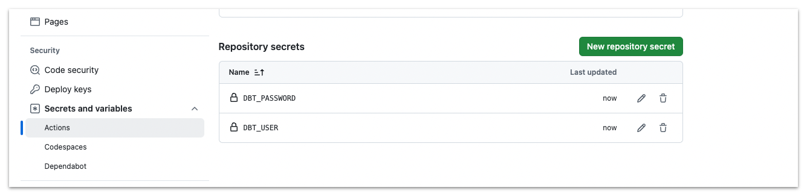
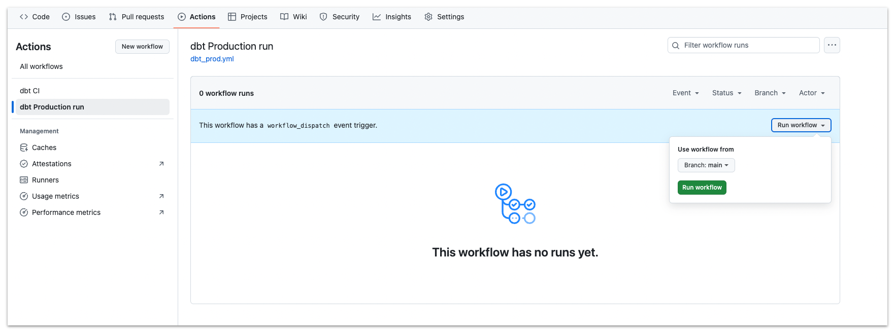
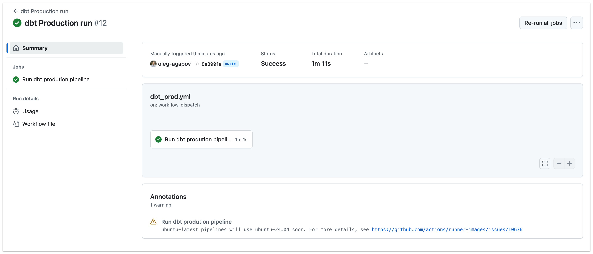

# Practice 6: Deploying to Production

In this practice, we will deploy our dbt project to production. We will use Github actions to automate the deployment process.

🎯 Goal: learn Pull Requests template, SQL linting, CI pipeline and deploying of dbt project via Github Actions.

## Step 1: Add PR template

When you are working in a team, it's important to have a consistent way of creating Pull Requests. You can use a template to guide the team members on what information should be included in the PR.

Create a new file `.github/PULL_REQUEST_TEMPLATE.md` with the following content:

```markdown
# Description

Describe what changes you made in this PR. This will make it easier for reviewers to understand the context of the changes.

## Testing

Describe how you tested the changes. This can include running dbt commands, providing SQL code, or adding screenshots.

```

Commit this new file to the main branch.

```bash
git add .github/PULL_REQUEST_TEMPLATE.md
git commit -m "Add PR template"
git push
```

Now, when you create a new Pull Request, you will see the template that you can fill out. Let's test it.

Create a new git branch:

```bash
git checkout -b cheking-pr-template
git push --set-upstream origin cheking-pr-template
```

To see the template in action, let's add one more section to our PR template and commit those changes.

Add the following content to the bottom of `.github/PULL_REQUEST_TEMPLATE.md` file:

```markdown

## Checklist

- [ ] I have tested the changes locally
- [ ] I have updated the documentation
- [ ] I have added tests
- [ ] I have run SQL linter
- [ ] I have assigned reviewers to this PR
```

Commit the changes:

```bash
git add .github/PULL_REQUEST_TEMPLATE.md
git commit -m "Update PR template"
git push
```

Now you can create a new Pull Request and see the updated template.Go to Github and create a new Pull Request.


After clicking on the "Compare & pull request" button, you will see the PR template that you can fill out:


Go and create a PR, and then merge it to the main branch.

## Step 2: Add SQL linter

SQL linter is a tool that checks your SQL code for syntax errors, style issues, and other potential problems. It helps you write clean and consistent SQL code.

We will use [SQLFluff](https://sqlfluff.com/) linter in this practice. To add SQLFluff to your dbt project, you need to install it first. You can install SQLFluff using pip.

First, add SQLFluff to the `requirements.txt` file:

```txt
sqlfluff
sqlfluff-templater-dbt
```

now you can install newly added dependencies:
```bash
pip install -r requirements.txt
```

Next step is to create a configuration file for SQLFluff. Create a new file `.sqlfluff` in the root of your dbt project with the following content:

```yaml
[sqlfluff]
templater = dbt
max_line_length = 80
dialect = snowflake

[sqlfluff:templater:dbt]
apply_dbt_builtins = true
profile = dbt_course
project_dir = ./dbt_course


[sqlfluff:indentation]
indent_unit = space
indented_ctes = False
indented_joins = True
indented_using_on = True
indented_on_contents = True
tab_space_size = 4
template_blocks_indent = True

[sqlfluff:layout:type:comma]
spacing_before = touch
line_position = trailing

[sqlfluff:templater:jinja]
apply_dbt_builtins = true
```

> ⚠️  Note: Pay attention to `profile` and `project_dir` settings in the configuration file. You need to adjust these settings according to your dbt project.

Also, create `.sqlfluffignore` file, it will help you to ignore some files or directories from linting:

```bash
analysis/
macros/
dbt_packages/
target/
```

Now you can try linting your whole project with:

```bash
sqlfluff lint
```

If you see any violations, you can try to automatically fix then with:

```bash
sqlfluff fix
```

> ⚠️ Note: not all violations can be fixed automatically (e.g. missing aliases or incorrect SQL syntax), so you may need to fix some of them manually.

## Step 3: Add a CI pipeline

Continuous Integration (CI) is a practice where developers regularly merge their code changes into a code repository. Each merge triggers an automated build and test process to ensure that the changes are working as expected. We will use Github Actions to create a CI pipeline for our dbt project. Github Actions is a CI service provided by Github that allows you to automate software development workflows.

We will create a simple CI pipeline that will run SQLFluff linter and builds the dbt project to catch any errors before merging the code to the main branch.

Create a new file `.github/workflows/dbt_ci.yml` with the following content:

```yaml
name: dbt CI

on:
  pull_request:
    types: [opened, synchronize, ready_for_review]

permissions:
  contents: read

env:
  DBT_USER: ${{ secrets.DBT_USER }}
  DBT_PASSWORD: ${{ secrets.DBT_PASSWORD }}

jobs:
  run-ci-pipeline:
    name: Run CI pipeline
    runs-on: ubuntu-latest
    timeout-minutes: 10

    steps:
      - name: Checkout code
        uses: actions/checkout@v4

      - name: Set up Python
        uses: actions/setup-python@v5
        with:
          python-version: '3.12'

      - name: Install requirements
        run: pip install -r requirements.txt
      
      - name: Install dbt pakages
        working-directory: ./dbt_course
        run: dbt deps --target ci

      - name: Copy dbt profiles
        run: mkdir ~/.dbt && cp .github/profiles.yml ~/.dbt/profiles.yml

      - name: Lint SQL files
        run: sqlfluff lint

      - name: Create dbt seeds
        working-directory: ./dbt_course
        run: dbt seed --target prod
      
      - name: Run dbt project in CI target
        working-directory: ./dbt_course
        run: dbt run --target prod
      
      - name: Run dbt tests
        working-directory: ./dbt_course
        run: dbt test --target prod

```

This pipeline will do the following:
1. download the code
2. install the required dependencies (python and dbt packages)
3. lint the SQL files
4. run the dbt project in CI target
5. run the dbt tests

To make this pipeline work, you need to add your dbt profile to the `.github` directory. Create a new file `.github/profiles.yml` with the following content:

```yaml
dbt_course:
  target: ci
  outputs:
    ci:
      type: snowflake
      account: sd96455.us-central1.gcp
      user: {{ env_var('DBT_USER') }}
      password: {{ env_var('DBT_PASSWORD') }}
      role: student__b_role
      database: dev
      # Add your username to the schema name!!!
      schema: dbt_ci__your_username
      warehouse: student_wh
```

> Note: Please make sure to add your username to the schema name, otherwise you will conflict with other students.

Now you need to add your Snowflake credentials to the Github repository secrets. Go to your Github repository, click on the "Settings" tab, then click on "Secrets and variables" -> "Actions" in the left sidebar. Add two new repository secrets: `DBT_USER` and `DBT_PASSWORD` with your Snowflake username and password.



Now you can push the changes to the main branch:

```bash
git add .github
git commit -m "Add CI pipeline"
git push
```

Now if you create a new PR with code changes, new pipeline should run automatically and check your code for errors.


Task: change something in your repository and create a new PR to see the CI pipeline in action.

## Step 4: Deploy to Github actions

Finally, let's deploy our dbt project to production using Github Actions. We will create a new workflow that will run the dbt project in the production target.

First, let's add new profile to the `.github/profiles.yml` file:

```yaml
dbt_course:
  target: ci
  outputs:
    ci:
      ...
    
    prod:
      type: snowflake
      account: sd96455.us-central1.gcp
      user: {{ env_var('DBT_USER') }}
      password: {{ env_var('DBT_PASSWORD') }}
      role: student__b_role
      database: dev
      schema: dbt_prod__your_username
      warehouse: student_wh
```

> ⚠️ Note: we will still be using DEV database here, but in a real-life scenario, you would have a separate database for production. Also, in produciton we usually have a different service account, role, and warehouse.

Next, we can create a new workflow file `.github/workflows/dbt_prod.yml` with the following content:

```yaml
name: dbt Production run

on:
  workflow_dispatch: # This event allows you to run the workflow manually

permissions:
  contents: read

env:
  DBT_USER: ${{ secrets.DBT_USER }}
  DBT_PASSWORD: ${{ secrets.DBT_PASSWORD }}

jobs:
  run-production-pipeline:
    name: Run dbt prodution pipeline
    runs-on: ubuntu-latest
    timeout-minutes: 10

    steps:
      - name: Checkout code
        uses: actions/checkout@v4

      - name: Set up Python
        uses: actions/setup-python@v5
        with:
          python-version: '3.12'

      - name: Install requirements
        run: pip install -r requirements.txt
      
      - name: Install dbt pakages
        working-directory: ./dbt_course
        run: dbt deps --target ci

      - name: Copy dbt profiles
        run: mkdir ~/.dbt && cp .github/profiles.yml ~/.dbt/profiles.yml

      - name: Lint SQL files
        run: sqlfluff lint

      - name: Create dbt seeds
        working-directory: ./dbt_course
        run: dbt seed --target prod
      
      - name: Run dbt project in CI target
        working-directory: ./dbt_course
        run: dbt run --target prod
      
      - name: Run dbt tests
        working-directory: ./dbt_course
        run: dbt test --target prod

```

This pipeline will do the same steps as the CI pipeline, but it will run the dbt project in the production target.

Also, pay attention to the `on` section of the workflow file. We are using `workflow_dispatch` event here, which allows you to run the workflow manually. You can trigger this workflow from the Github Actions tab in your repository. In real project you could also add a cron schedule to run this workflow automatically.

Now you can push the changes to the main branch:

```bash
git add .github/
git commit -m "Add production deployment"
git push
```

Now if you go to "Actions" tab in your Github repository, you will see two new workflows: `dbt CI` and `dbt Production run`.



You can run the `dbt Production run` workflow manually to check how it works.


